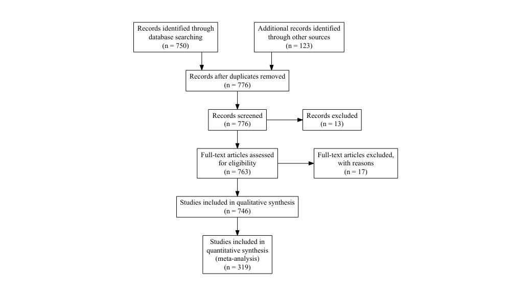

# Summary

The [Preferred Reporting Items for Systematic Reviews and Meta-Analyses](http://prisma-statement.org) (PRISMA) Statement  [@moher_preferred_2009] defines an evidence-based, minimal set of items for reporting in systematic reviews and meta-analyses. PRISMA should be used for the reporting of studies evaluating randomized clinical trials (RCTs), and is also for reporting on systematic reviews of other types of research.

Meta-analysis is a critical tool in evidence-based medicine, forming the basis of international recommendations and guiding local medical practice. Unfortunately, a large amount of published medical research is likely to be false [@ioannidis_why_2005]. This increases the importance of good meta-analysis of potentially flawed studies in order to reduce bias. An effort has been made to raise the standard of work accepted in major medical journals, for both primary research and systematic reviews. For example, for randomized controlled trials, we have the widely enforced CONSORT statement [@Schulz_CONSORT2010Statement_2010]. PRISMA is the analogue of CONSORT for meta-analysis and systematic reviews.

The importance of these efforts to raise standards is so great that the PRISMA Statement has been published in multiple medical journals [e.g., @Moher_Preferredreportingitems_2010; @Liberati_PRISMAstatementreporting_2009], and the following of its guidelines has become a requirement for authors wishing to publish meta-analyses and systematic reviews in major journals.

In addition to increasing the standard of research in general, the movement towards reproducible research continues, with a drive to publish more data and to automate and publish the statistical analysis. The "Living Systematic Review" brings the reproducible concept to systematic reviews and extends it by allowing prompt updates as new evidence is published [@Elliott_Livingsystematicreview_2017]. With these goals and trends in mind, the `PRISMAstatement` package for the R statistical software [@R] enables construction of a correct PRISMA flow diagram which can be generated as part of a reproducible workflow in R.

The R packages such as `ggplot2` [@ggplot2], `rmarkdown` [@rmarkdown], `rticles` [@rticles] give researchers the tools to produce manuscripts incorporating their analysis, figures and text, entirely within the R environment. However, plotting flow charts is not straightforward, especially not those that confirm to the specific PRISMA statement requirements. Most researchers are likely to resort to producing their PRISMA flow diagram in another application then import the resulting figure. This is a possible source of errors, and a barrier to reproducible research: with `PRISMAstatement` it is now possible to use a reproducible workflow up-to-date PRISMA flow diagram of publication quality.

# Example PRISMA Statement flow chart

# References
